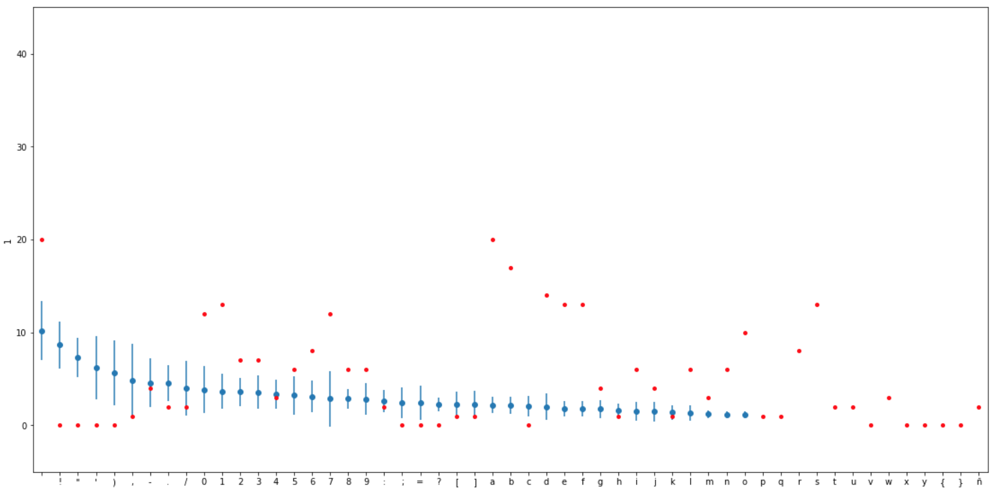
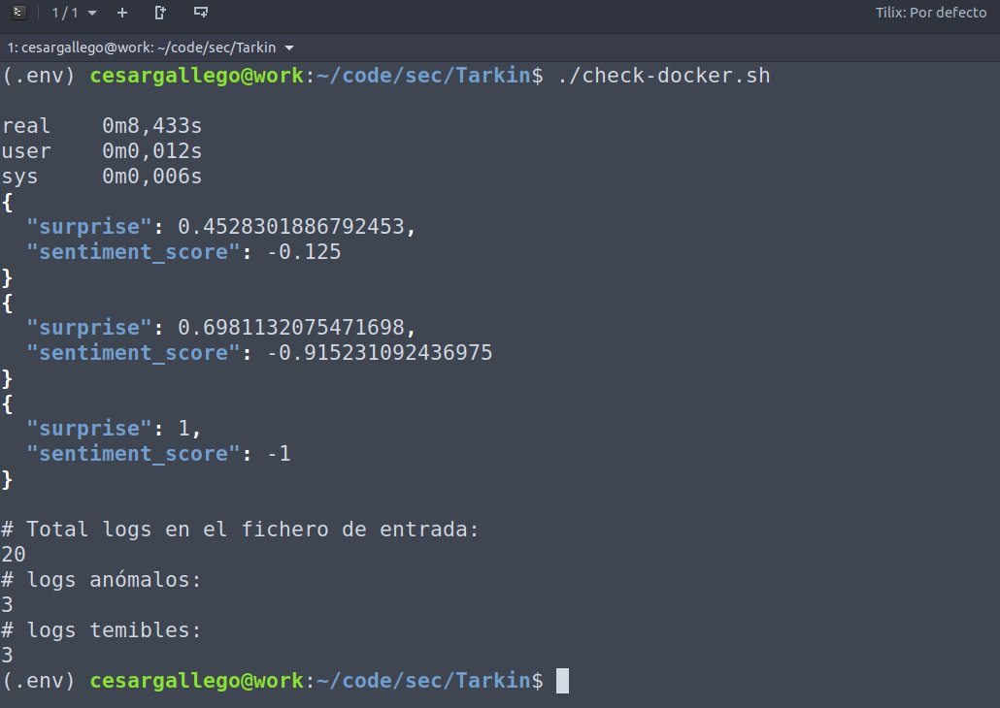

# Security Anomalies in Logs Data

Tarkin is a project aimed to perform anomaly detection over security logs data.

# Approach

Have you ever felt a shiver down your spine at the sight of a log line, even before reading it completely? That's because 
you spotted something unusual and probably one or two old keywords that, in your experience, are usually associated with issues.

Detecting anomalies, and especially security-related ones, is a hard job that too often requires going through zillions 
of log lines, queue messages, database registers, etc. To make things even more difficult this usually happens under tight
time pressure to identify the origin and reasons of an incident. 

There are tools out there that promise to reduce this load by classifying them automatically but they are barely 
more than specialized spam filters that pay little to none attention to the meaning of the message, and still require
to check on each tagged result to help improving the accuracy, making us work for the system but offering no flexibility. 
 
We believe it takes more than statistics to spot particular types of anomalies. Also, we believe simplicity is the key
for powerful systems. This is why we decided to emulate the intuition of human analysts faced to this problem, modelling
the "fear" the feel by reading the logs through the filters of their instinct and domain experience.    

The project is named after the Grand Moff Tarkin, a Star Wars character who lends his name to the Tarkin Doctrine, a
policy based he proposed to allow the Empire rule the galaxy without the burden of bureaucracy. 

## How it works (in a nutshell)

Tarkin implements a pipelined models strategy that starts applying a character frequency analysis to the content of the
message. 

Then adds sentiment analysis on top of that to show only messages with an overall negative meaning.

The result is an indicator of the "fear" perceived in each message by the system, which is used to filter out the ones
below the set threshold.

# Requirements

You need Python 3.6.x or later to run  Tarkin. You can have multiple Python versions (2.x and 3.x) installed on the same system without problems.

In Ubuntu, Mint and Debian you can install Python 3 like this:

    $ sudo apt-get install python3 python3-pip
    
In OS X you can install Python using [Brew](https://brew.sh) like this:

    $ brew install python3

For other Linux flavors and Windows, packages are available at

[http://www.python.org/getit/](http://www.python.org/getit/)

To run the project in your python3 environment, you will need to install the dependencies in the requirements.txt file, and
it's highly recommended to create a separate virtual env, see below. Execute the following n a terminal window:

    $ cd security-anomales-logs-data
    $ pip install -r requirements.txt

Then, you will need to run the following command:

    $ python -m spacy download en

## Working with virtualenv

If you are using virtualenv, make sure you are running a python3 environment. Installing via pip3 in a v2 environment
will not configure the environment to run installed modules from the command line.

    $ python3 -m pip install -U virtualenv
    $ python3 -m virtualenv env
    $ source ./env/bin/activate  # Enter into VirtualEnv

# Quick start

There are several shell scripts available from the top level directory of the project:

* build.sh: Initializes the environment creating the necessary folders and building the docker images.

The project can be run in your own machine and python installation. You will first need to run the training script, then
you can execute check.sh or check-demo.sh to analyze files configured in the same script or quoted sentences
passed as command line parameters, respectively.

* train.sh: Starts the training of the letter frequency model, producing a letterspace.pkl binary file.
* check.sh: Evaluates the infrequency and applies sentiment analysis to the logs of the file configured in the script.     
* check-demo.sh: Useful for demo purposes; evaluates the infrequency and applies sentiment analysis to a quoted sentence
received as a script parameter. NOTICE: unlike check.sh, this script returns an evaluation result even if the sentiment
score value is above 0.   

You can also run the dockerized version of the project, which is launched using the following equivalent shell scripts:

* train-docker.sh
* check-docker.sh
* check-demo-docker.sh

# Notebooks

The project includes a notebook to illustrate how the fear indicator is calculated. Before being able to run it, 
you'll need to execute the following commands from your virtual env:

    $ python3 -m pip install jupyter seaborn matplotlib
    $ jupyter notebook

Then navigate on your browser to Tarkin/notebooks from the Jupyter Home tree 
and open the file <code>Log Mining.ipynb</code>. 

In case you experience an error running the notebook cells, make sure you executed the <code>./build.sh</code> script 
that sets up the project by building the docker images and downloading the default lexicon dictionary, which is used 
by the notebook, or do it again if unsure. 

# Contributing

Feedback, ideas and contributions are welcome. For more details, please see the [CONTRIBUTING.md](CONTRIBUTING.md) file.

# License

This project is distributed under the [Apache License](http://www.apache.org/licenses/LICENSE-2.0)
